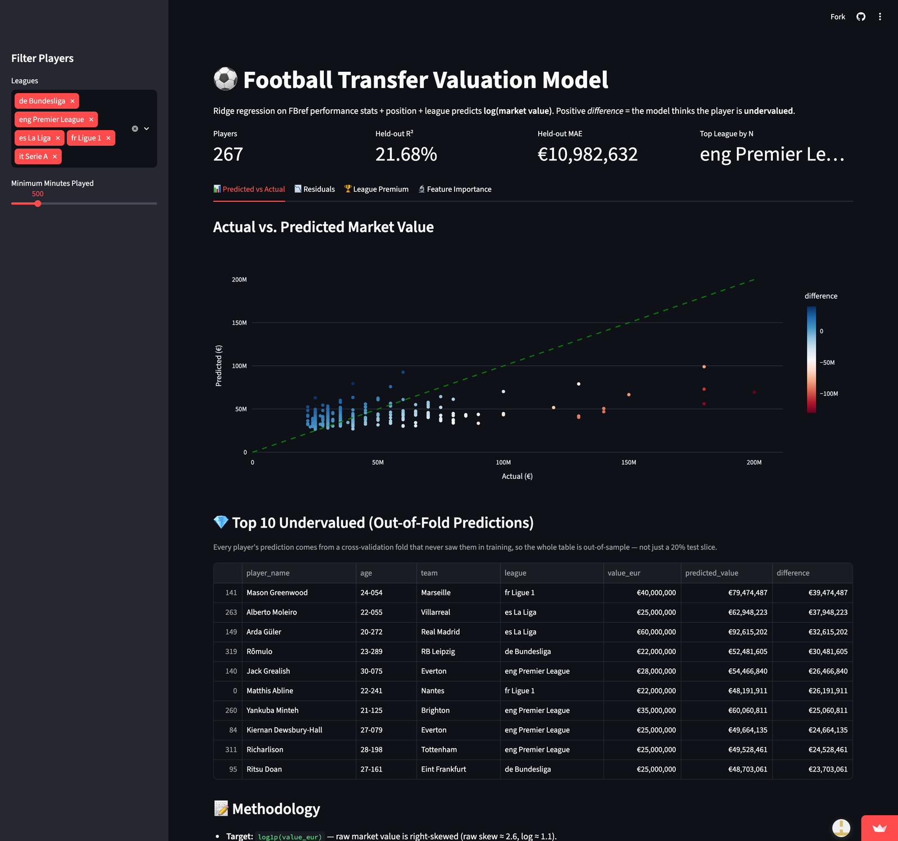

# Football Transfer Valuation

[](https://football-transfer-valuation.streamlit.app)
[](https://github.com/tubolyroli/football-transfer-valuation/actions/workflows/ci.yml)

🔗 **Live demo:** https://football-transfer-valuation.streamlit.app
*(Hosted on Streamlit Community Cloud's free tier — if the app has gone to sleep, the
first visit shows a wake-up screen and takes about a minute to load.)*

An end-to-end data science pipeline that estimates the fair market value of footballers
in the top 5 European leagues by combining performance stats (FBref) with market valuations
(Transfermarkt), then surfaces under-/over-valued players via an interactive dashboard.
The question extends my BSc thesis, a Blinder–Oaxaca decomposition of the
"Premier League premium" in transfer fees — this project attacks the same problem with ML.

**Headline:** tuned Ridge reaches **€14.8M held-out MAE vs €17.6M** for the
mean-prediction baseline — beating RandomForest and GradientBoosting on the same hold-out.



## What this project demonstrates
* **Data engineering:** Multi-source ingestion, fuzzy name matching with diacritic
  normalization (Vinícius Júnior --> Vinicius Junior), reproducible pipeline.
* **Data quality:** Automated Great Expectations checks that gate the pipeline.
* **Modeling:** Ridge regression on log-transformed values with categorical encoding;
  hyperparameters selected by 5-fold `GridSearchCV` on the training split only; three
  model leaderboard (Ridge / RandomForest / GradientBoosting) scored on a held-out test set.
* **Honest evaluation:** All player rankings use out-of-fold predictions
  (`cross_val_predict`), so no player is scored by a model that saw them in training.
* **Analysis:** Quantifies league-level price premium (is there a "Premier League Tax"?)
  via out-of-fold residuals and the model's standardized coefficients.
* **Communication:** EDA + modeling notebooks with the story, plus a four-tab Streamlit
  dashboard (predictions, residuals, league premium, feature importance).
* **Testing & CI:** 17 pytest tests on the cleaning utilities + pipeline output;
  GitHub Actions runs the suite and the Great Expectations gate on every push.

## Results (top-500 most-valuable players, 405 matched)

All hyperparameters tuned with 5-fold `GridSearchCV` on the training split; test metrics
come from the untouched 20% hold-out.

| Model            | Best params (grid-searched)       | Held-out R² | Held-out MAE | CV R² (log, train) |
|------------------|-----------------------------------|-------------|--------------|--------------------|
| **Ridge**        | **alpha = 31.6**                  | **0.25**    | **€14.8M**   | **0.19 ± 0.12**    |
| RandomForest     | depth 5, sqrt features            | 0.08        | €15.1M       | 0.17 ± 0.11        |
| GradientBoosting | lr 0.01, depth 2, 300 trees       | 0.04        | €15.4M       | 0.17 ± 0.10        |

Two things worth noticing: cross-validation pushed Ridge's alpha from the default 1.0 to
**31.6** (at n=405, variance is the dominant error source, so heavy shrinkage wins), and
both tree ensembles chose their most *conservative* grid corner, and they still lose. This is
the bias-variance trade-off empirically: a linear inductive bias matches the weak,
roughly linear signal better than trees hunting for interactions 324 training rows can't
support sufficiently.

## Model Card

Ridge MAE vs. baseline (always predicting the mean): **€14.8M vs. €17.6M**.
The model is expected to be off by ~€15M on average: this a large error in absolute terms,
but a clear improvement over the naive baseline on a deliberately hard problem.

## Project Structure
```
src/
  parse_fbref.py           Parse cached FBref HTML → CSV
  transfermarkt_scraper.py Scrape Transfermarkt market values
  data_cleaning.py         Normalize names, merge, write final dataset
  qa_check.py              Great Expectations validation suite
  model.py                 Train & compare three models
  app.py                   Streamlit dashboard (4 tabs)
notebooks/
  01_eda.ipynb             Exploratory analysis & modeling decisions
  02_modeling.ipynb        Hyperparameter tuning & model selection (the analysis behind model.py)
tests/
  test_data_cleaning.py    17 tests on cleaning + pipeline sanity
data/processed/            Merged master table        
.github/workflows/
  ci.yml                   CI: pytest + Great Expectations gate on every push
```

## Setup & Reproducibility
```bash
pip install -r requirements.txt

# 1. Build the dataset
python src/parse_fbref.py             # parse cached FBref HTML
python src/transfermarkt_scraper.py   # scrape Transfermarkt
python src/data_cleaning.py           # merge + normalize names

# 2. Validate data quality (exits non-zero on failure — CI-ready)
python src/qa_check.py

# 3. Train & evaluate models
python src/model.py

# 4. Launch the dashboard
streamlit run src/app.py

# 5. Run tests
pytest tests/ -v
```

## Tech Stack
Python 3.10+ · pandas · scikit-learn · Great Expectations · Streamlit · Plotly · pytest

## Design Choices Worth Noting
* **Cached FBref HTML.** FBref aggressively blocks scrapers; the raw HTML is treated as
  a versioned input artifact rather than scraped live. See `src/parse_fbref.py` for
  refresh instructions.
* **Log-transformed target.** Raw market value has skew ≈ 2.6; log1p reduces skew
  to ≈ 1.1 and gives a ~40% relative R² improvement.
* **Honest out-of-sample reporting.** R²/MAE come from a held-out 20% test set that is
  never seen during hyperparameter tuning. Undervalued rankings and league premium use
  out-of-fold predictions (`cross_val_predict`), so every player is scored by a model
  that never trained on them. One caveat stated openly: with alpha ≈ 30, predictions are
  shrunk toward the mean, so median premia skew slightly negative — the *ordering* of
  leagues is the claim, not absolute premium levels.
* **Selection bias is acknowledged.** Sample is the top-500 most-valuable players, so
  the model learns to discriminate *among* expensive players — not to identify expensive
  players from nothing.

## Limitations
* No contract length, no commercial/marketing value, no injury history.
* Single season of stats (a 3-season window would surface true outliers, not random ones).
* Position is collapsed to primary role; multi-position flexibility is ignored.
